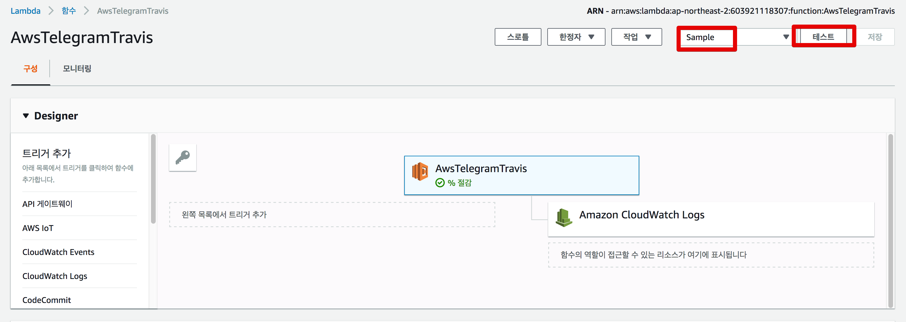

# 1. 텔레그램 봇과 AWS Lambda & AWS Gateway 연동

## 1-1. Telegram Bot 생성

[BotFather](https://telegram.me/BotFather)에서 새로운 봇을 생성합니다.


* ```/newbot```을 입력해서 새로운 봇 생성을 시작합니다.
* ```AwsTelegramTravis``` 라는 이름의 봇을 생성합니다.
  * 본인이 원하시는 봇 이름을 입력하면 됩니다.
* 방금전에 생성한 ```AwsTelegramTravis``` 봇이 ```@AwsTelegramTravis_bot``` 이란 username을 갖도록 합니다.
  * 앞에는 꼭 ```@```를 붙여야 합니다.
  * 마지막엔 꼭 ```bot```이 붙어야 합니다.
* 마지막 메세지에 포함된 token 값은 어딘가에 꼭 저장해놓으셔야 합니다.
  * 해당 Bot을 관리하는 키 값이라고 생각하시면 됩니다.

생성이 끝나셨으면 마지막 메세지에 있는 ```t.me/봇username``` 링크를 클릭합니다.  
그럼 아래처럼 입장 모드가 됩니다.


**START**를 클릭합니다.  

그럼 아래 처럼 방금 생성한 Bot 채팅이 시작 됩니다.


Bot 생성은 여기까지입니다.  
바로 AWS Lambda로 넘어가겠습니다.  

## 1-2. AWS Lambda와 Bot 연동

> AWS Lambda의 경우 **월 100만건까지 무료**입니다.  
개인이 쓰기에 충분한 양입니다.  
  
바로 Lambda 페이지로 이동하신뒤, 대시보드의 **함수 생성** 버튼을 클릭합니다.


아래처럼 각 항목을 선택 & 입력합니다.


* Nodejs를 사용할 예정이라 Node.js를 선택합니다.,
* 역할의 경우 생성된게 없으니 **새 역할 생성**을 선택합니다.
* 정책 템플릿에서 **기본 Edge Lambda 권한**을 선택합니다.

입력이 끝나시고 생성 버튼을 클릭하시면 아래처럼 AWS Lambda가 생성됩니다.


간단한 코드를 하나 추가해보겠습니다.  
**함수 코드** 영역에 아래와 같이 코드를 작성합니다.


```js
exports.handler = (event, context) => {
    console.log('event: ', JSON.stringify(event));
    context.succeed('Hello World, ' + JSON.stringify(event));
};
```

우측 상단의 **저장** 버튼으로 한번 저장하시고, 이 Lambda 코드가 잘 작동하는지 간단한 테스트를 해보겠습니다.  
저장 버튼 옆의 테스트 이벤트 구성을 선택합니다.


테스트로 보낼 Request Body 를 구성합니다.


```js
{
  "message": {
    "chat": {
      "id": 1,
      "first_name": "테스트",
      "last_name": "사용자",
      "type": "private"
    },
    "text": "안녕하세요"
  }
}

```

작성된 테스트를 한번 실행해보겠습니다.  
**테스트** 버튼을 클릭합니다.



응답 결과와 로그가 테스트로 보낸 Request Body 를 전달해주는 것을 확인할 수 있습니다! 


Lambda의 샘플 코드는 완성 되었습니다.  
Lambda 생성 페이지는 그대로 두시고, 새로 브라우저를 열어 이번엔 **API Gateway**로 이동합니다.  

### API Gateway 연동


작업 -> 메서드 생성 버튼을 차례로 클릭합니다.


**POST** 메서드를 선택하시고 아래처럼 각 항목을 입력합니다.


그럼 아래처럼 Gateway API 가 하나 생성 됩니다.  


중앙의 **테스트** 버튼을 클릭합니다.  
테스트할 Request Body를 입력해야하는데요.  
좀전에 Lambda에서 사용한 본문을 그대로 사용하겠습니다.


```js
{
  "message": {
    "chat": {
      "id": 1,
      "first_name": "테스트",
      "last_name": "사용자",
      "type": "private"
    },
    "text": "안녕하세요"
  }
}

```

자 테스트 버튼을 클릭하시면!  
우측 화면에 응답 결과가 아주 잘 나타납니다!  
AWS Lambda와 Gateway가 잘 연동된것을 알 수 있습니다.


연동된것을 확인하였으니 이 Gateway API 를 배포하겠습니다.

> AWS Gateway API는 **배포가 되어야만 외부에서 호출** 할 수 있습니다.


취향대로 본인의 항목을 입력하시고 **배포** 버튼을 클릭합니다.


배포가 되면 외부에 제공할 수 있는 API가 할당 됩니다.  
보시면 URL 호출 영역에 있는 주소가 **외부에서 AWS Gateway API를 호출할 수 있는 URL 주소**입니다.  


이 주소를 통해 텔레그램 봇과 통신할 예정입니다.  
AWS Lambda와 AWS Gateway API도 잘 연결되었으니 이제 텔레그램과 연동해보겠습니다.

## 1-3. Telegram과 AWS Gateway API 연동

