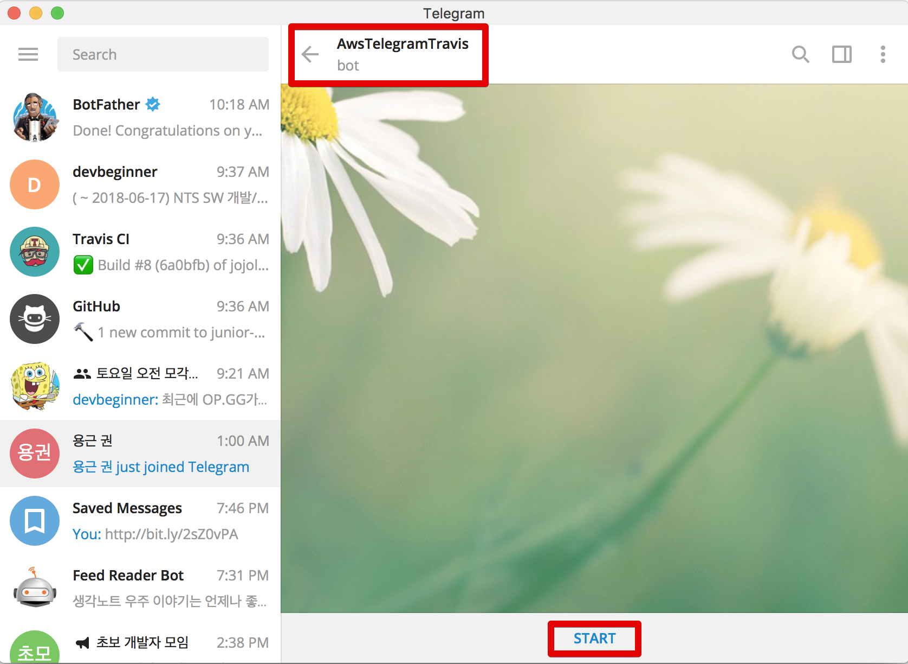
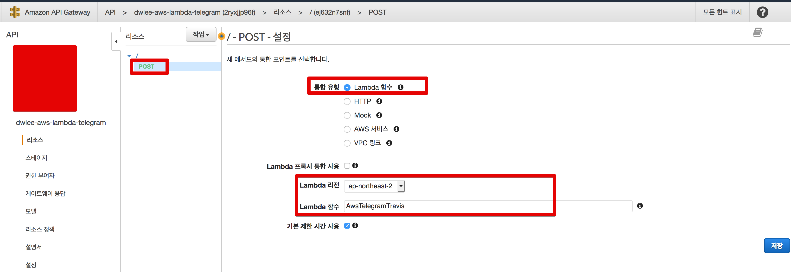

# 1. 텔레그램 봇과 AWS Lambda & AWS Gateway 연동

[주니어 개발자 채용 정보](https://github.com/jojoldu/junior-recruit-scheduler) 텔레그램 Bot을 만들었습니다.  
그 과정을 다른 분들도 따라할 수 있게 시리즈로 진행할 예정입니다.  

전체적인 구조는 다음과 같습니다.


이 구조를 하나씩 구현해나가겠습니다.

## 1-1. Telegram Bot 생성

[BotFather](https://telegram.me/BotFather)에서 새로운 봇을 생성합니다.


* ```/newbot```을 입력해서 새로운 봇 생성을 시작합니다.
* ```AwsTelegramTravis``` 라는 이름의 봇을 생성합니다.
  * 본인이 원하시는 봇 이름을 입력하면 됩니다.
* 방금전에 생성한 ```AwsTelegramTravis``` 봇이 ```@AwsTelegramTravis_bot``` 이란 username을 갖도록 합니다.
  * 앞에는 꼭 ```@```를 붙여야 합니다.
  * 마지막엔 꼭 ```bot```이 붙어야 합니다.
* 마지막 메세지에 포함된 token 값은 어딘가에 꼭 저장해놓으셔야 합니다.
  * 해당 Bot을 관리하는 키 값이라고 생각하시면 됩니다.

생성이 끝나셨으면 마지막 메세지에 있는 ```t.me/봇username``` 링크를 클릭합니다.  
그럼 아래처럼 입장 모드가 됩니다.



**START**를 클릭합니다.  

그럼 아래 처럼 방금 생성한 Bot 채팅이 시작 됩니다.


Bot 생성은 여기까지입니다.  
바로 AWS Lambda로 넘어가겠습니다.  

## 1-2. AWS Lambda와 Bot 연동

> AWS Lambda의 경우 **월 100만건까지 무료**입니다.  
개인이 쓰기에 충분한 양입니다.  
  
바로 Lambda 페이지로 이동하신뒤, 대시보드의 **함수 생성** 버튼을 클릭합니다.


아래처럼 각 항목을 선택 & 입력합니다.


* Nodejs를 사용할 예정이라 Node.js를 선택합니다.,
* 역할의 경우 생성된게 없으니 **새 역할 생성**을 선택합니다.
* 정책 템플릿에서 **기본 Edge Lambda 권한**을 선택합니다.

입력이 끝나시고 생성 버튼을 클릭하시면 아래처럼 AWS Lambda가 생성됩니다.


간단한 코드를 하나 추가해보겠습니다.  
**함수 코드** 영역에 아래와 같이 코드를 작성합니다.


```js
exports.handler = (event, context) => {
    console.log('event: ', JSON.stringify(event));
    context.succeed('Hello World, ' + JSON.stringify(event));
};
```

우측 상단의 **저장** 버튼으로 한번 저장하시고, 이 Lambda 코드가 잘 작동하는지 간단한 테스트를 해보겠습니다.  
저장 버튼 옆의 테스트 이벤트 구성을 선택합니다.


테스트로 보낼 Request Body 를 구성합니다.


```js
{
  "message": {
    "chat": {
      "id": 1,
      "first_name": "테스트",
      "last_name": "사용자",
      "type": "private"
    },
    "text": "안녕하세요"
  }
}

```

작성된 테스트를 한번 실행해보겠습니다.  
**테스트** 버튼을 클릭합니다.


응답 결과와 로그가 테스트로 보낸 Request Body 를 전달해주는 것을 확인할 수 있습니다! 


Lambda의 샘플 코드는 완성 되었습니다.  
Lambda 생성 페이지는 그대로 두시고, 새로 브라우저를 열어 이번엔 **API Gateway**로 이동합니다.  

### API Gateway 연동


작업 -> 메서드 생성 버튼을 차례로 클릭합니다.


**POST** 메서드를 선택하시고 아래처럼 각 항목을 입력합니다.



그럼 아래처럼 Gateway API 가 하나 생성 됩니다.  


중앙의 **테스트** 버튼을 클릭합니다.  
테스트할 Request Body를 입력해야하는데요.  
좀전에 Lambda에서 사용한 본문을 그대로 사용하겠습니다.


```js
{
  "message": {
    "chat": {
      "id": 1,
      "first_name": "테스트",
      "last_name": "사용자",
      "type": "private"
    },
    "text": "안녕하세요"
  }
}

```

자 테스트 버튼을 클릭하시면!  
우측 화면에 응답 결과가 아주 잘 나타납니다!  
AWS Lambda와 Gateway가 잘 연동된것을 알 수 있습니다.


연동된것을 확인하였으니 이 Gateway API 를 배포하겠습니다.

> AWS Gateway API는 **배포가 되어야만 외부에서 호출** 할 수 있습니다.


취향대로 본인의 항목을 입력하시고 **배포** 버튼을 클릭합니다.


배포가 되면 외부에 제공할 수 있는 API가 할당 됩니다.  
보시면 URL 호출 영역에 있는 주소가 **외부에서 AWS Gateway API를 호출할 수 있는 URL 주소**입니다.  


이 주소를 통해 텔레그램 봇과 통신할 예정입니다.  
AWS Lambda와 AWS Gateway API도 잘 연결되었으니 이제 텔레그램과 연동해보겠습니다.

## 1-3. Telegram과 AWS Gateway API 연동

1-1에서 만든 Telegram Bot에 1-2에서 만든 AWS Gateway API를 웹훅으로 등록해야 합니다.  

> 웹훅이란 이벤트에 대한 응답을 반환할 URL을 얘기합니다.  

curl 이나 Postman, [IntelliJ .http](http://jojoldu.tistory.com/266) 등 편하신 방법으로 HTTP Get 요청을 보냅니다.

```bash
curl https://api.telegram.org/bot<API TOKEN>/setWebhook?url=<API endpoint URL>
```

여기서 주의하실게 몇가지 있는데요.

* ```bot<API TOKEN>```에서 bot은 무조건 붙여야 합니다.
  * bot 뒤에 처음 (1-1) 발급 받은 토큰값을 바로 붙여넣으시면 됩니다.
* 꺽쇠 (```<>```)는 지우시고 붙이셔야 합니다.
* API endpoint는 1-2에서 만든 AWS Gateway API의 URL을 등록하시면 됩니다.

저는 IntelliJ ```.http```를 통해 요청을 하겠습니다.  


응답이 ```true```로 잘 떨어졌으면 등록 완료 된 것입니다.  
잘 등록되었는지 AWS Lambda 코드를 수정해서 확인해보겠습니다.  

### AWS Lambda 코드 수정

1-2에서 생성한 AWS Lambda 페이지로 이동합니다.  
그리고 아래처럼 코드를 수정합니다.


```js
const https = require('https');
const util = require('util');
const TOKEN = process.env.TOKEN;

exports.handler = (event, context) => {
    console.log('event: ', JSON.stringify(event));
    const content = {
        "chat_id": event.message.chat.id,
        "text": event.message.text
    }
    ;
    sendMessage(context, content);
};

function sendMessage(context, content) {
    const options = {
        method: 'POST',
        hostname: 'api.telegram.org',
        port: 443,
        headers: {"Content-Type": "application/json"},
        path: "/bot" + TOKEN + "/sendMessage"
    };

    const req = https.request(options, (res) => {
        res.setEncoding('utf8');
        res.on('data', (chunk) => {
            context.done(null);
        });
    });

    req.on('error', function (e) {
        console.log('problem with request: ' + e.message);
    });

    req.write(util.format("%j", content));
    req.end();
}
```

Telegram은 요청이 오더라도, **응답 결과를 요청자에게 바로 보낼수 없습니다**.  
그래서 요청자의 채팅방 ID (```chat_id```)를 통해서 해당 채팅방으로 HTTP Request를 보내는 방식으로만 가능합니다.  
Telegram에서는 메세지의 내용을 ```text```라는 필드로 관리하기 때문에 ```text```에는 제가 보낸 메세지 그대로를 다시 반환하도록 합니다.  
  
그리고 Token 값이 필요한데, 이 값은 코드에서 관리하기 보다는 환경 변수로 등록해서 사용하겠습니다.  

> 코드는 Git 등으로 관리하다가 외부에 노출될수도 있기 때문입니다.


자 여기까지 하셨으면 모든 작업은 완료되었습니다.  
Bot에 메세지를 보내보겠습니다!

## 1-4. 최종 테스트

본인이 생성한 Bot에 간단한 메세지를 보냅니다.


이렇게 메세지가 정상적으로 똑같이 응답하는것을 확인할 수 있습니다!  
  
혹시나 제대로 되고 있는지 로그 데이터를 확인하고 싶으시다면 Cloud Watch로 가시면 저희가 ```console.log```로 찍은 모든 내용을 확인할 수 있습니다.


어떠셨나요?  
크게 어려운 부분은 없으셨죠?  
다음 시간엔 S3 & TravisCI를 통해 JSON 파일을 챗봇 응답으로 제공하는 방법을 공유드리겠습니다.
