# 2. TravisCI와 S3를 이용하여 정적 데이터 관리하기

최근에 많은 Github 저장소에서 유용한 정보들을 제공하고 있습니다.  
국내에는 다음과 같은 좋은 저장소들이 있는데요.

* [국내 개발 블로그 모음](https://github.com/sarojaba/awesome-devblog)
* [개발 관련 밋업, 세미나 모음](https://github.com/dev-meetup/dev-meetup.github.io)
* [기술 면접 모음](https://github.com/JaeYeopHan/Interview_Question_for_Beginner)
* [개발자 회고 모음](https://github.com/oaksong/developers-retrospective)
* [주니어 개발자 채용 정보](https://github.com/jojoldu/junior-recruit-scheduler)

본인이 이런 데이터를 모으고, 
이를 **Bot으로 안내해주는 서비스**를 만든다고 가정하시면 
어디에다 이 정보들을 관리할지가 고민일 수 있습니다.  
  
일반적인 웹 서비스처럼 생각한다면 데이터베이스에 저장해서 사용할수 있습니다.  
하지만 이처럼 **변경요소가 거의 없고, 조회만 대부분**인 상황에서 데이터베이스를 쓰기엔 비용이나 시간이 너무 아깝습니다.  
  
그래서 많은 저장소 운영자분들이  ```json``` 파일로 정보를 관리하십니다.    
예를 들어 제가 운영 중인 주니어 개발자 채용 정보의 경우 채용 정보를 ```db.json``` 으로 관리합니다.

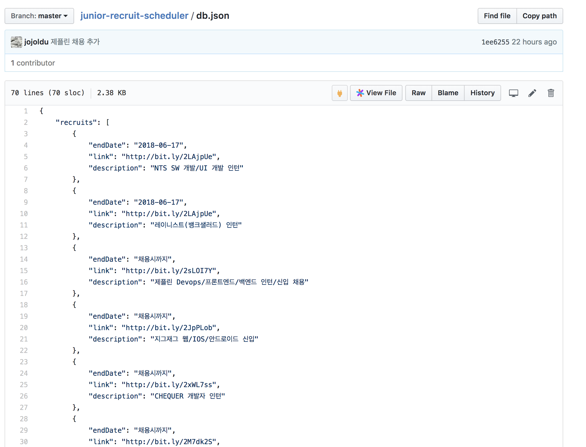

(예시)  
  
이렇게 **데이터를 json파일로 관리하고, 이 파일을 S3에 올려놓고 Bot에서 필요할때마다 호출**해서 사용하면 아주 저렴하고 간단하게 운영할 수 있게 됩니다.  
  
이번 시간엔 바로 이 과정을 진행하겠습니다.  

## 2-1. Travis CI & S3 연동하기

S3에 json파일을 올리는걸 사람이 수동으로 계속 할 수는 없습니다.  
**json 파일을 고칠때마다 자동으로 S3에 업로드**되야만 편하겠죠?  
프로젝트의 파일을 고치고 git commit & push하면 다음 행위를 자동으로 하는걸 저희는 회사에서 자주 경험하고 있습니다.  
바로 **CI**입니다.  
  
젠킨스나 AWS Code Build, Travis CI 등 여러 CI툴을 통해 git push가 발생할때마다 build & test 가 자동으로 수행되는걸 많은 분들이 경험하고 계실거라 생각합니다.  
  
여기선 무료 CI 툴인 Travis CI를 통해 push가 발생하면 자동으로 json 파일을 S3에 올리도록 구성하겠습니다.  

### Travis CI에 저장소 등록

[Travis CI](https://travis-ci.org/)에 접속하셔서 저장소를 등록합니다.


저장소를 검색하고 활성화 버튼을 클릭합니다.

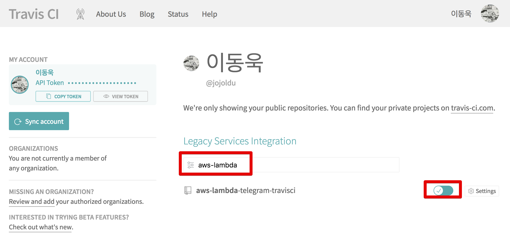

활성화가 된 뒤에 다시 메인페이지로 가보시면 저장소가 등록된 것을 확인할 수 있습니다.

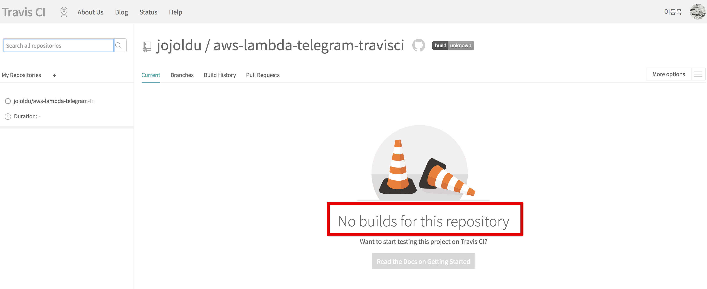

현재 ```.travis.yml```이 없어 빌드를 진행할 수 없습니다.  
그래서 프로젝트와 Travis CI를 연동하겠습니다.

### AWS S3 Bucket 생성 및 IAM User 생성

재일 먼저 **json 데이터를 보관할 S3 bucket을 생성**하겠습니다.  

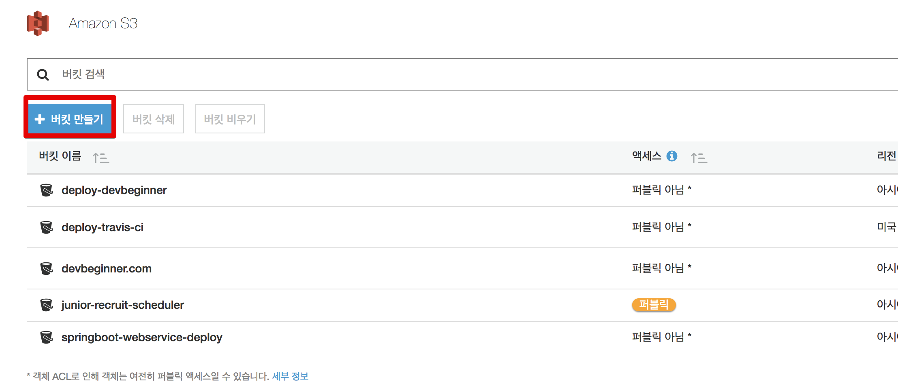

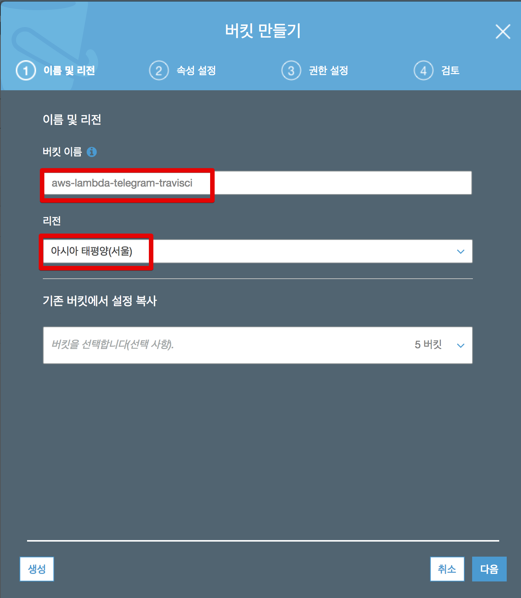

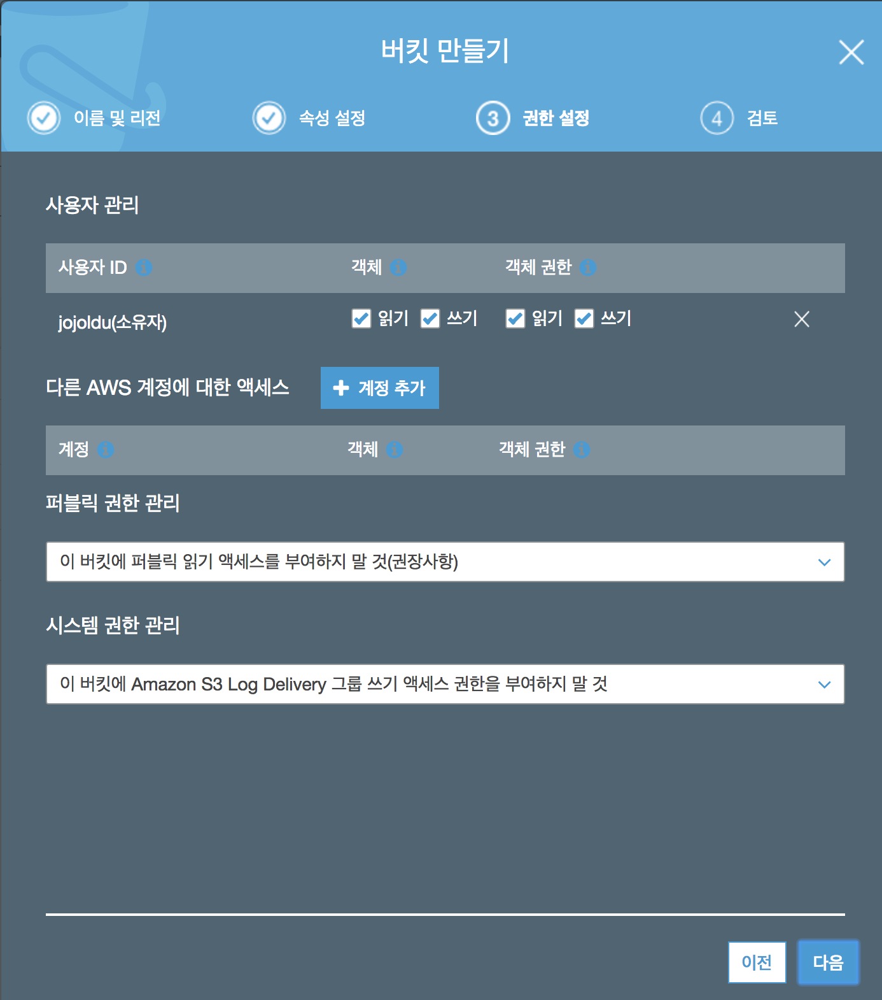

자 그리고 **Travis CI가 S3에 json 파일을 업로드** 할 수 있도록 사용자를 하나 생성하겠습니다.  

> AWS 서비스 외에 다른 서버 혹은 서비스에서 AWS 서비스를 쓰려면 IAM User를 생성해서 해당 계정의 키를 사용해야만 합니다. (ex: IDC 서버에서 AWS S3를 쓰거나, Travis CI에서 Code Deploy 쓰는 등)  
IAM Role 할당은 AWS 서비스내에서만 가능하기 때문입니다.  


IAM 서비스로 이동하신뒤 사용자 -> 사용자 추가를 클릭합니다.

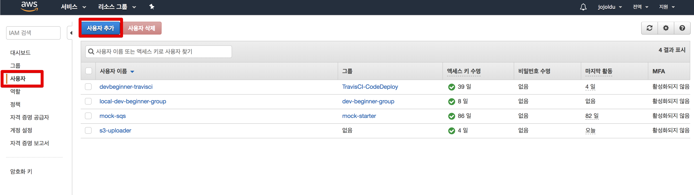

사용할 사용자 이름을 입력하신뒤,

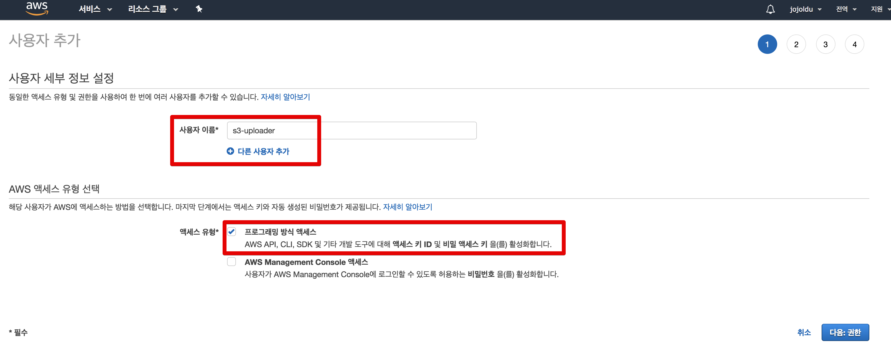

S3FullAccess를 선택합니다.

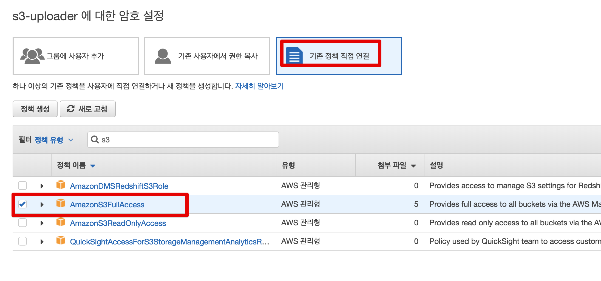

그럼 아래처럼 access key와 secret key가 나오는데요.  

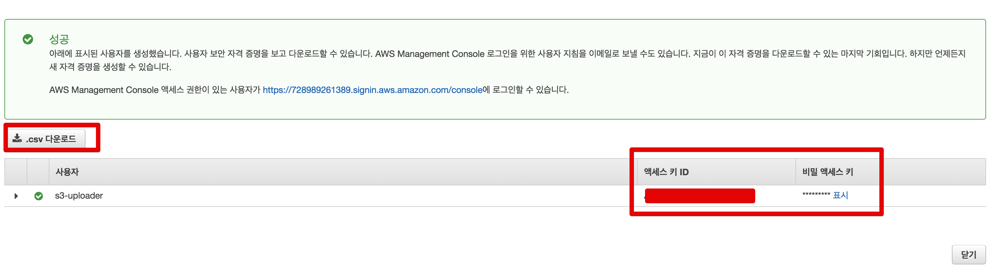

Travis CI 에서 둘다 사용해야하니 별도로 저장해놓습니다.  

> csv 다운로드를 하셔도 됩니다.

그리고 이 Key들을 Travis CI에 등록합니다.

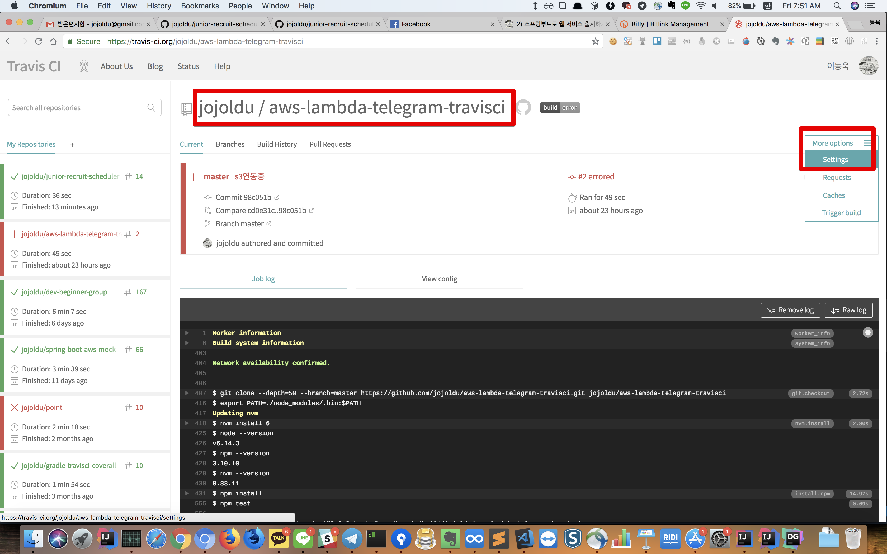

Environment Variables에 각각 Key를 등록합니다.

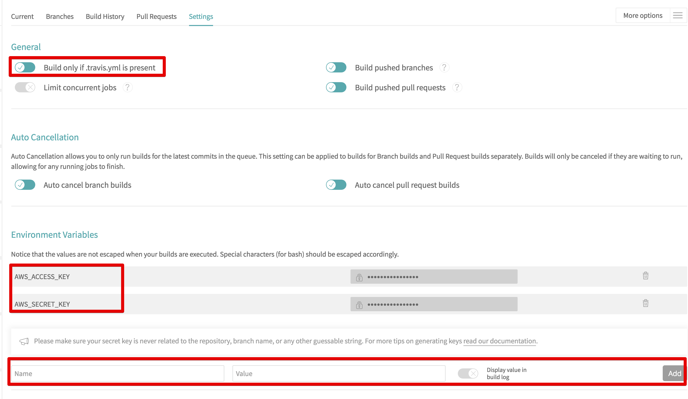

자 이렇게 하시면 준비는 끝났습니다!  
본격적으로 프로젝트와 연동을 진행해보겠습니다.

### Travis CI와 프로젝트 연동

프로젝트와 Travis CI의 관계는 ```.travis.yml``` 로 표현합니다.  
여기서는 아래처럼 간단한 구조로 생성하겠습니다.

```yaml
language: node_js
node_js:
  - "6"

branches:
  only:
    - master

# deploy전에 실행할 명령어
before_deploy:
  - mkdir -p deploy
  - mv db.json deploy/db.json

deploy:
  - provider: s3
    access_key_id: $AWS_ACCESS_KEY # Travis CI에서 설정한 AWS_ACCESS_KEY
    secret_access_key: $AWS_SECRET_KEY # Travis CI에서 설정한 AWS_SECRET_KEY
    bucket: aws-lambda-telegram-travisci # S3 bucket 명
    region: ap-northeast-2
    skip_cleanup: true
    local_dir: deploy # S3로 올릴 디렉토리 대상 (before_deploy에서 생성함)
    acl: public_read
    wait-until-deployed: true
    on:
      repo: jojoldu/aws-lambda-telegram-travisci # 저장소 이름
      branch: master

after_deploy:
  - echo "S3 업로드 끝났습니다."
```


 ```.travis.yml```의 라이프 사이클은 다음과 같습니다.

1. before_deploy
2. deploy
3. after_deploy

> 좀 더 자세한 라이프 사이클을 알고 싶으시면 [공식 API](https://docs.travis-ci.com/user/customizing-the-build#The-Build-Lifecycle)를 참고해보세요!

여기서는 ```before_deploy```에서 db.json을 ```deploy``` 디렉토리로 이동시키고, S3에 ```deploy``` 디렉토리 내용 전부를 올립니다.  
  
혹시나! ```package.json```에 ```test```명령어가 없다면 아래처럼 추가해주세요.  
TravisCI에서는 Node 환경의 프로젝트는 ```npm run test```를 수행하기 때문에 없다면 에러가 발생합니다.

```js

"test": "echo \"no test specified\""

```

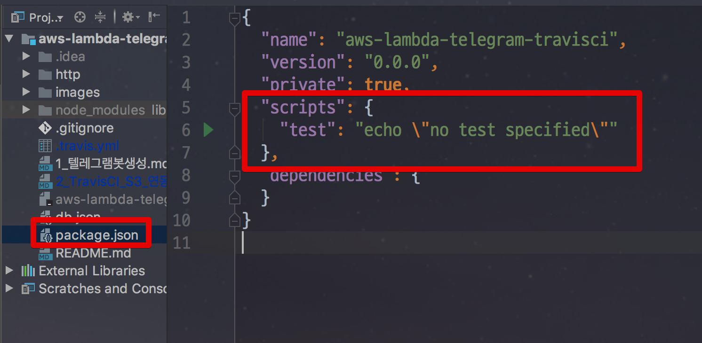


자 그리고 이제 S3로 올릴 ```db.json```을 만들겠습니다.

```js

{
  "recruits": [
    {
      "team": "[배민아키텍처팀] 서버 개발자",
      "link": "http://bit.ly/2HL4FQs"
    },
    {
      "team": "[배민플랫폼개발실] 서버 개발자",
      "link": "http://bit.ly/2HL4FQs"
    },
    {
      "team": "[배민서비스개발실] 서버 개발자",
      "link": "http://bit.ly/2HL4FQs"
    },
    {
      "team": "웹 프론트엔드 개발자",
      "link": "http://bit.ly/2HL4FQs"
    }
  ]
}

```

> 우아한형제들 채용중입니다 여러분!  
[채용공고](http://bit.ly/2HL4FQs)

이렇게 다 하셨다면 이제 **commit & push 할때마다 S3에 db.json**이 바로 올라갑니다.  
그럼 한번 해볼까요?

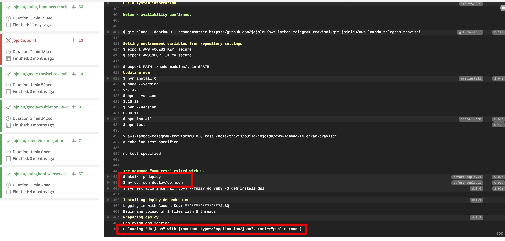

Travis CI의 빌드가 끝나고 S3를 확인해보시면!

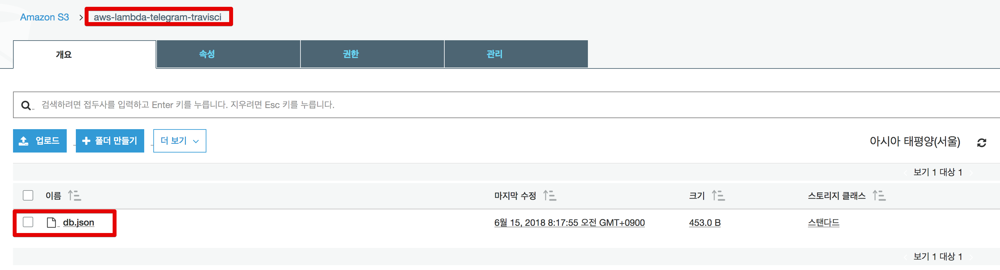

이렇게 S3에 db.json 이 잘 올라간것을 확인할 수 있습니다.


> Telegram으로 Travis CI 배포 알람을 받고 싶으시다면 이전에 포스팅한 [4. 텔레그램 연동](http://jojoldu.tistory.com/275)을 참고해보세요!

## 2-2. AWS Lambda & S3 연동하기

자 이제 이 S3에 올라간 db.json 파일을 AWS Lambda에서 사용해보겠습니다.  
1편에서 만든 Lambda의 코드를 아래처럼 변경하겠습니다.  

```js

const TOKEN = process.env.TOKEN; //환경변수에 등록한 값
const JSON_URL = process.env.JSON_URL; //환경변수에 등록한 값

const https = require('https');
const util = require('util');
const { StringDecoder } = require('string_decoder');
const decoder = new StringDecoder('utf8');

exports.handler = (event, context) => {
    console.log('event: ', JSON.stringify(event));
    const chatId = event.message.chat.id;
    const requestText = event.message.text;

    // /recruits로 오면 db.json 내용 반환
    if(requestText === "/recruits"){
        // db.json 호출
        https.get(JSON_URL, (res) => {
            res.on('data', (d) => { 
                const strJson = decoder.write(d); //db.json 데이터를 js에서 인식할 수 있는 문자열로 decode
                const recruits = JSON.parse(strJson).recruits; // json string을 json으로 전환후 recruits 배열을 반환
                const content = {
                    "chat_id": chatId,
                    "text": toMessage(recruits)
                };
                sendMessage(context, content);
            });
        });
    } else {
        // 나머지 메세지는 온 그대로 전달
        const content = {
            "chat_id": chatId,
            "text": requestText
        };
        sendMessage(context, content);
    }
};

function toMessage(recruits) {
    return recruits
        .map( (r) => r.team + " ("+r.link+")")
        .join("\n");
}

function sendMessage(context, content) {
    const options = {
        method: 'POST',
        hostname: 'api.telegram.org',
        port: 443,
        headers: {"Content-Type": "application/json"},
        path: "/bot" + TOKEN + "/sendMessage"
    };

    const req = https.request(options, (res) => {
        res.setEncoding('utf8');
        res.on('data', (chunk) => {
            context.done(null);
        });
    });

    req.on('error', function (e) {
        console.log('problem with request: ' + e.message);
    });

    req.write(util.format("%j", content));
    req.end();
}

```

그리고 최상단에서 사용한 JSON_URL을 환경변수에 등록하겠습니다.  
JSON_URL은 db.json의 url입니다.  
S3로 가보시면 바로 확인할 수 있습니다.

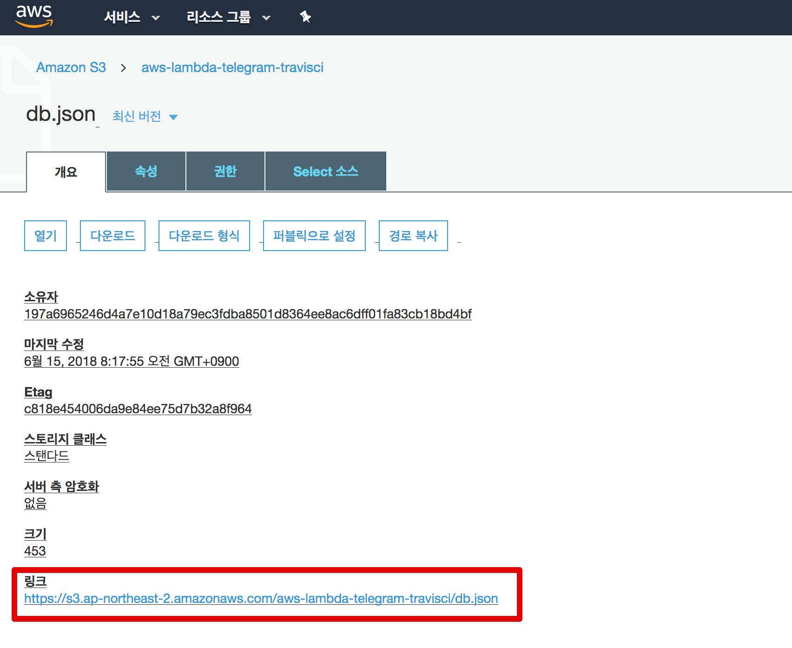

이 값을 환경변수에 등록합니다.

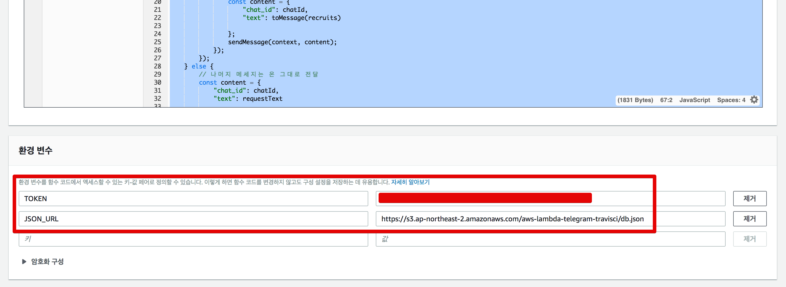

자 이제 모든 작업이 끝났습니다!  

### Telegram 테스트 #1

Lambda 코드를 저장하신 후, Telegram에 ```/recruits``` 메세지를 보내보겠습니다.
그러면!

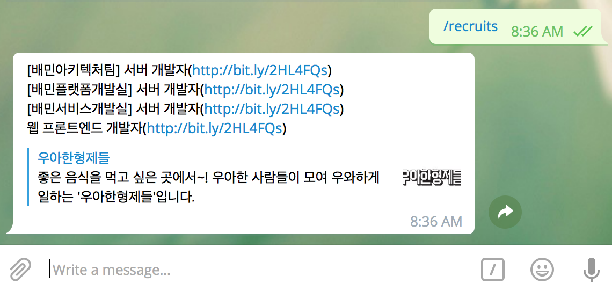

이렇게 아주 메세지가 잘 전달되는것을 확인할 수 있습니다!

## 2-3. db.json 검증하기

여기서 끝나면 조금 찝찝합니다.  
db.json 파일에 오타가 있는데 이걸 검증하는 코드거 어디에도 없죠?  
json 파일이 언제든지 오타로 인해 깨질 수 있기 때문에 이에 대한 검증 코드를 추가하겠습니다.  
  
방법은 간단합니다.  
**Travis CI에서 빌드 시작시 db.json 파일을 읽어** ```JSON.parse```가 **가능한지를 확인**합니다.  
  
먼저 ```src``` 디렉토리를 생성하고 그 안에 ```build.js```를 추가합니다.

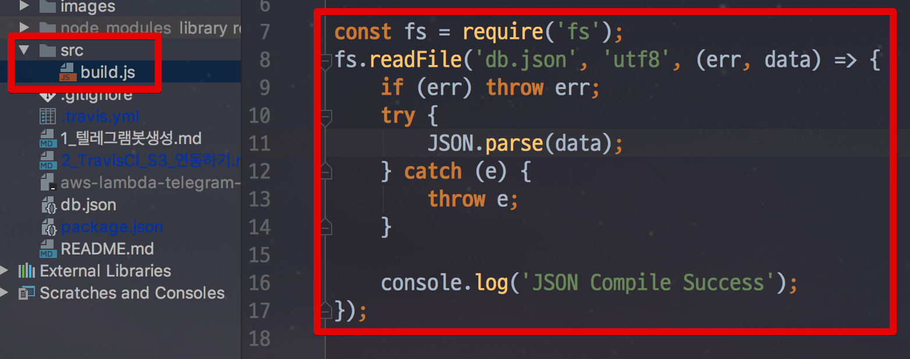

```js
const fs = require('fs');
fs.readFile('db.json', 'utf8', (err, data) => {
    if (err) throw err;
    try {
        JSON.parse(data);
    } catch (e) {
        throw e;
    }

    console.log('JSON Compile Success');
});
```

그리고 ```.travis.yml```에 ```build.js```를 실행하는 코드를 추가하겠습니다.

```yml
script: "node src/build.js"
```

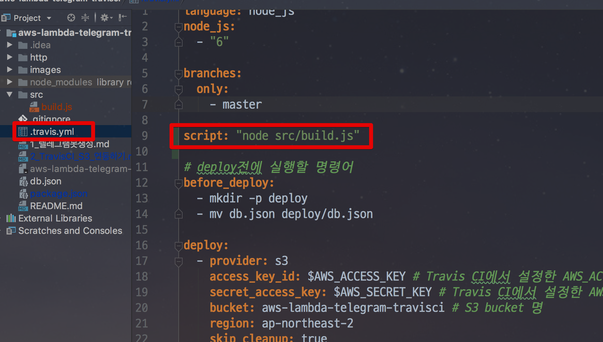

* ```script```는 ```before_deploy```보다 먼저 실행됩니다.