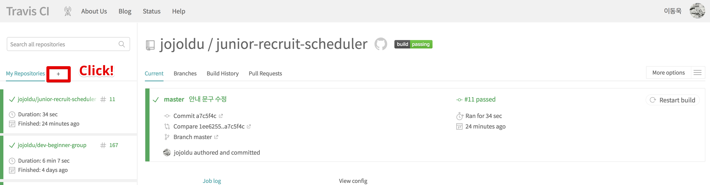
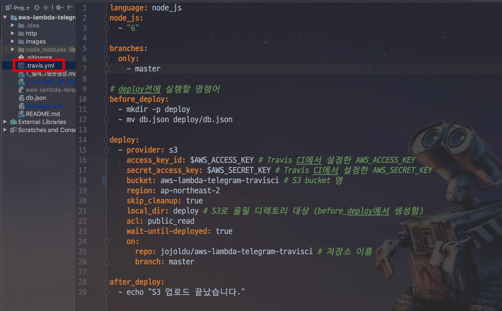

# 2. TravisCI와 S3를 이용하여 정적 데이터 관리하기

최근에 많은 Github 저장소에서 유용한 정보들을 제공하고 있습니다.  
국내에는 다음과 같은 좋은 저장소들이 있는데요.

* [국내 개발 블로그 모음](https://github.com/sarojaba/awesome-devblog)
* [개발 관련 밋업, 세미나 모음](https://github.com/dev-meetup/dev-meetup.github.io)
* [기술 면접 모음](https://github.com/JaeYeopHan/Interview_Question_for_Beginner)
* [개발자 회고 모음](https://github.com/oaksong/developers-retrospective)
* [주니어 개발자 채용 정보](https://github.com/jojoldu/junior-recruit-scheduler)

본인이 이런 데이터를 모으고, 
이를 **Bot으로 안내해주는 서비스**를 만든다고 가정하시면 
어디에다 이 정보들을 관리할지가 고민일 수 있습니다.  
  
일반적인 웹 서비스처럼 생각한다면 데이터베이스에 저장해서 사용할수 있습니다.  
하지만 이처럼 **변경요소가 거의 없고, 조회만 대부분**인 상황에서 데이터베이스를 쓰기엔 비용이나 시간이 너무 아깝습니다.  
  
그래서 많은 저장소 운영자분들이  ```json``` 파일로 정보를 관리하십니다.    
예를 들어 제가 운영 중인 주니어 개발자 채용 정보의 경우 채용 정보를 ```db.json``` 으로 관리합니다.


(예시)  
  
이렇게 **데이터를 json파일로 관리하고, 이 파일을 S3에 올려놓고 Bot에서 필요할때마다 호출**해서 사용하면 아주 저렴하고 간단하게 운영할 수 있게 됩니다.  
  
이번 시간엔 바로 이 과정을 진행하겠습니다.  

## 2-1. Travis CI & S3 연동하기

S3에 json파일을 올리는걸 사람이 수동으로 계속 할 수는 없습니다.  
**json 파일을 고칠때마다 자동으로 S3에 업로드**되야만 편하겠죠?  
프로젝트의 파일을 고치고 git commit & push하면 다음 행위를 자동으로 하는걸 저희는 회사에서 자주 경험하고 있습니다.  
바로 **CI**입니다.  
  
젠킨스나 AWS Code Build, Travis CI 등 여러 CI툴을 통해 git push가 발생할때마다 build & test 가 자동으로 수행되는걸 많은 분들이 경험하고 계실거라 생각합니다.  
  
여기선 무료 CI 툴인 Travis CI를 통해 push가 발생하면 자동으로 json 파일을 S3에 올리도록 구성하겠습니다.  

### Travis CI에 저장소 등록

[Travis CI](https://travis-ci.org/)에 접속하셔서 저장소를 등록합니다.



저장소를 검색하고 활성화 버튼을 클릭합니다.


활성화가 된 뒤에 다시 메인페이지로 가보시면 저장소가 등록된 것을 확인할 수 있습니다.


현재 ```.travis.yml```이 없어 빌드를 진행할 수 없습니다.  
그래서 프로젝트와 Travis CI를 연동하겠습니다.

### AWS S3 Bucket 생성 및 IAM User 생성

재일 먼저 **json 데이터를 보관할 S3 bucket을 생성**하겠습니다.  


자 그리고 **Travis CI가 S3에 json 파일을 업로드** 할 수 있도록 사용자를 하나 생성하겠습니다.  

> AWS 서비스 외에 다른 서버 혹은 서비스에서 AWS 서비스를 쓰려면 IAM User를 생성해서 해당 계정의 키를 사용해야만 합니다. (ex: IDC 서버에서 AWS S3를 쓰거나, Travis CI에서 Code Deploy 쓰는 등)  
IAM Role 할당은 AWS 서비스내에서만 가능하기 때문입니다.  


IAM 서비스로 이동하신뒤 사용자 -> 사용자 추가를 클릭합니다.


사용할 사용자 이름을 입력하신뒤,


S3FullAccess를 선택합니다.


그럼 아래처럼 access key와 secret key가 나오는데요.  


Travis CI 에서 둘다 사용해야하니 별도로 저장해놓습니다.  

> csv 다운로드를 하셔도 됩니다.

그리고 이 Key들을 Travis CI에 등록합니다.


Environment Variables에 각각 Key를 등록합니다.


자 이렇게 하시면 준비는 끝났습니다!  
본격적으로 프로젝트와 연동을 진행해보겠습니다.

### Travis CI와 프로젝트 연동

프로젝트와 Travis CI의 관계는 ```.travis.yml``` 로 표현합니다.  
여기서는 아래처럼 간단한 구조로 생성하겠습니다.

```yaml
language: node_js
node_js:
  - "6"

branches:
  only:
    - master

# deploy전에 실행할 명령어
before_deploy:
  - mkdir -p deploy
  - mv db.json deploy/db.json

deploy:
  - provider: s3
    access_key_id: $AWS_ACCESS_KEY # Travis CI에서 설정한 AWS_ACCESS_KEY
    secret_access_key: $AWS_SECRET_KEY # Travis CI에서 설정한 AWS_SECRET_KEY
    bucket: aws-lambda-telegram-travisci # S3 bucket 명
    region: ap-northeast-2
    skip_cleanup: true
    local_dir: deploy # S3로 올릴 디렉토리 대상 (before_deploy에서 생성함)
    acl: public_read
    wait-until-deployed: true
    on:
      repo: jojoldu/aws-lambda-telegram-travisci # 저장소 이름
      branch: master

after_deploy:
  - echo "S3 업로드 끝났습니다."
```



 ```.travis.yml```의 라이프 사이클은 다음과 같습니다.

1. before_deploy
2. deploy
3. after_deploy

> 좀 더 자세한 라이프 사이클을 알고 싶으시면 [공식 API](https://docs.travis-ci.com/user/customizing-the-build#The-Build-Lifecycle)를 참고해보세요!

여기서는 ```before_deploy```에서 db.json을 ```deploy``` 디렉토리로 이동시키고, S3에 ```deploy``` 디렉토리 내용 전부를 올립니다.  
  
혹시나! ```package.json```에 ```test```명령어가 없다면 아래처럼 추가해주세요.  
TravisCI에서는 Node 환경의 프로젝트는 ```npm run test```를 수행하기 때문에 없다면 에러가 발생합니다.

```js

"test": "echo \"Error: no test specified\" && exit 1"

```


자 그리고 이제 S3로 올릴 ```db.json```을 만들겠습니다.

```js

{
  "recruits": [
    {
      "team": "[배민아키텍처팀] 서버 개발자",
      "link": "http://bit.ly/2HL4FQs"
    },
    {
      "team": "[배민플랫폼개발실] 서버 개발자",
      "link": "http://bit.ly/2HL4FQs"
    },
    {
      "team": "[배민서비스개발실] 서버 개발자",
      "link": "http://bit.ly/2HL4FQs"
    },
    {
      "team": "웹 프론트엔드 개발자",
      "link": "http://bit.ly/2HL4FQs"
    }
  ]
}

```

> 우아한형제들 채용중입니다 여러분!  
[채용공고](http://bit.ly/2HL4FQs)


그리고 ```.travis.yml```을 생성합니다.

```yaml
language: node_js
node_js:
  - "6"

branches:
  only:
    - master

# deploy전에 실행할 명령어
before_deploy:
  - mkdir -p deploy
  - mv db.json deploy/db.json

deploy:
  - provider: s3
    access_key_id: $AWS_ACCESS_KEY # Travis CI에서 설정한 AWS_ACCESS_KEY
    secret_access_key: $AWS_SECRET_KEY # Travis CI에서 설정한 AWS_SECRET_KEY
    bucket: junior-recruit-scheduler # S3 bucket 명
    region: ap-northeast-2
    skip_cleanup: true
    local_dir: deploy # S3로 올릴 디렉토리 대상 (before_deploy에서 생성함)
    acl: public_read
    wait-until-deployed: true
    on:
      repo: jojoldu/aws-lambda-telegram-travisci # 저장소 이름
      branch: master

after_deploy:
  - echo "S3 업로드 끝났습니다."
```


> Telegram으로 Travis CI 배포 알람을 받고 싶으시다면 이전에 포스팅한 [4. 텔레그램 연동](http://jojoldu.tistory.com/275)을 참고해보세요!

## 2-2. AWS Lambda & S3 연동하기