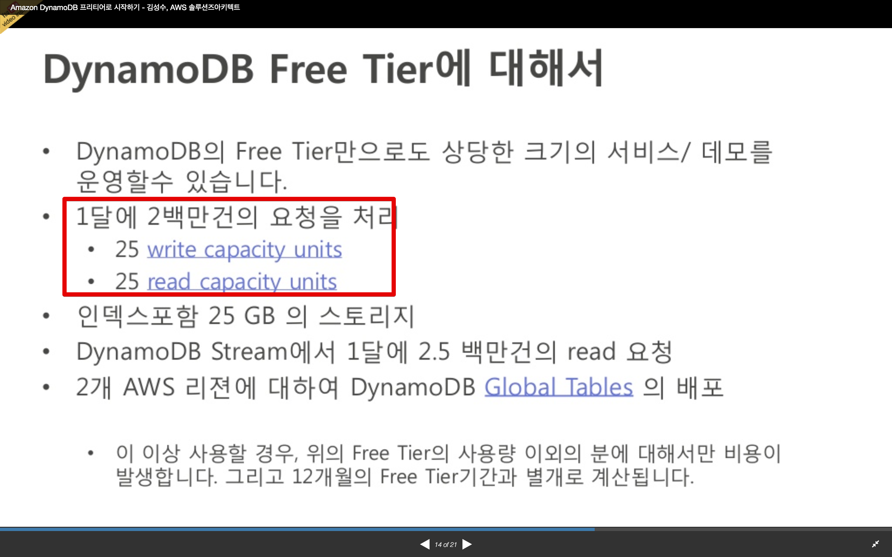
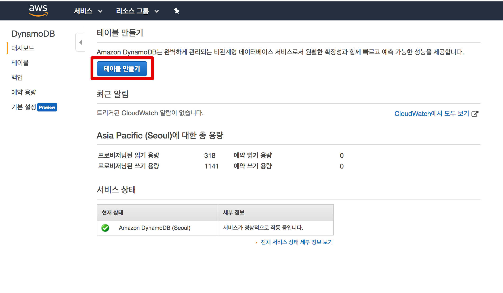
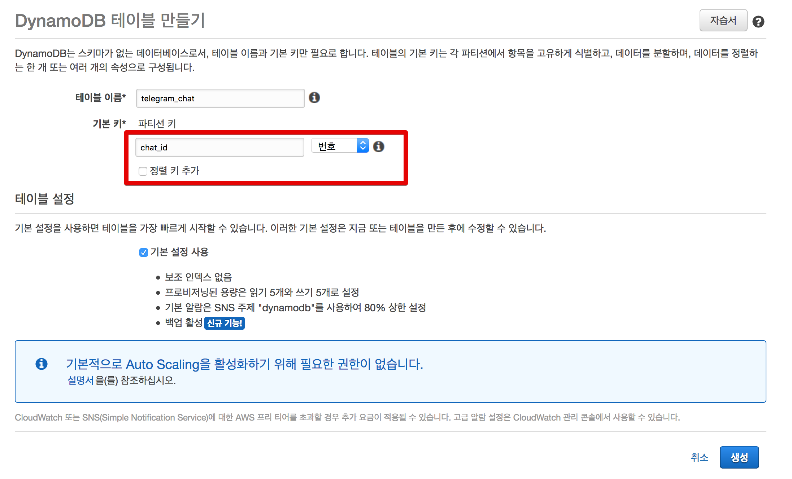
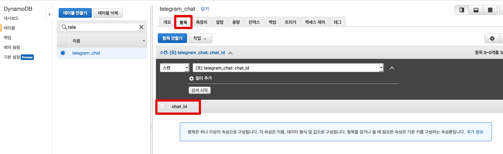
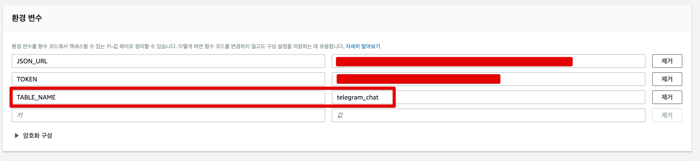
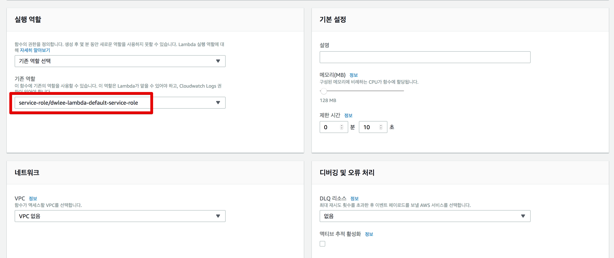
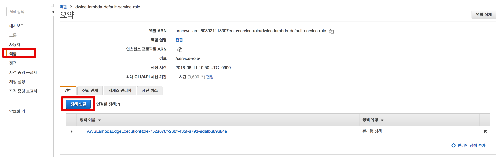
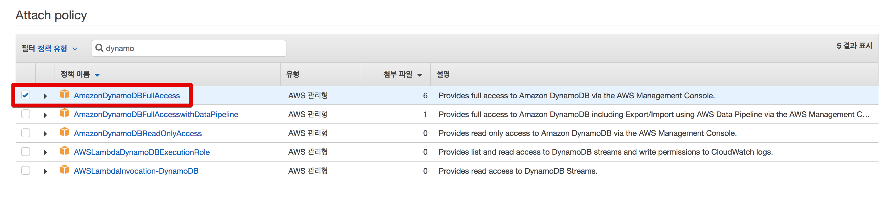

# 3. DynamoDB를 이용한 전체 공지

이번 시간에는 Telegram의 전체 공지 기능을 구현해보겠습니다.  
Telegram에는 **전체 공지 기능이 없습니다**.  
그래서 챗봇을 쓰는 모든 유저에게 메세지를 전송하기 위해선 **별도의 공간에 채팅방 ID를 저장**해야만 합니다.  
  
그 과정을 하나씩 소개드리겠습니다.

## 1. ID 등록

저희의 챗봇을 사용하는 사용자들의 채팅방 ID (chat_id)를 저장해야만 합니다.  
저장소는 DynamoDB를 선택합니다.

* 복잡한 트랜잭션이 필요하지 않으며
* JSON 형태로 저장하기 쉽고
* 고성능의 저장소

비용은 아래 보시는것처럼 개인이 쓰기에 충분한 양입니다.



(참고: [Amazon DynamoDB 프리티어로 시작하기](https://www.slideshare.net/awskorea/amazon-dynamodb-freetier))

### DynamoDB 생성

서비스에서 DynamoDB를 검색해서 이동하신뒤, 테이블 만들기를 클릭합니다.



아래 이미지대로 항목을 선택/입력 합니다.



* 파티션키는 RDB로 치면 PK로 보시면 됩니다.
* 이진수를 선택해야 합니다.
    * chat_id가 숫자이기 때문에 기본값인 문자열로 할 경우 숫자 -> 문자로 형변환 하는 코드가 추가되어야해서 불편합니다.

생성이 완료 되시면 아래처럼 한번 확인해봅니다.



자 chat_id를 저장할 장소가 완성 되었습니다.  
이제 이곳에 가입할 수 있는 기능을 추가해보겠습니다.

### 기존 Lambda 기능 추가

이 포스팅에서 Lambda는 크게 2가지 변화가 있습니다.

* 기존에 생성한 챗봇 Lambda에 DynamoDB 저장/삭제 기능 추가
* DynamoDB에 저장된 모든 chat_id에 일괄 메세지 전송하는 신규 Lambda 추가

첫번째로 기존 Lambda에 DynamoDB 저장/삭제 기능을 추가해보겠습니다.  
추가할 코드는 아래와 같습니다.

```js
const TABLE_NAME = process.env.TABLE_NAME;

const AWS = require('aws-sdk'),
    docClient = new AWS.DynamoDB.DocumentClient();

...
    else if(requestText === "/subscribe") {
        const payload = {
            TableName: TABLE_NAME,
            Item: {
                "chat_id": chatId
            }
        };

        docClient.put(payload, (err, data) => {
            if (err) {
                console.log(err, err.stack);
                const postData = {
                    "chat_id": chatId,
                    "text": "등록에 실패했습니다.\n잠시후 다시 시도해주세요."
                };
                sendMessage(context, postData);
                throw err;
            } else {
                const postData = {
                    "chat_id": chatId,
                    "text": "등록되었습니다."
                };
                sendMessage(context, postData);
            }
        });
    } else if(requestText === "/unsubscribe") {
        const payload = {
            TableName: TABLE_NAME,
            Key: {
                "chat_id": chatId
            }
        };

        docClient.delete(payload, (err, data) => {
            if (err) {
                console.log(err, err.stack);
                const postData = {
                    "chat_id": chatId,
                    "text": "등록 해제에 실패했습니다.\n잠시후 다시 시도해주세요."
                };
                sendMessage(context, postData);
                throw err;
            } else {
                const postData = {
                    "chat_id": chatId,
                    "text": "등록 해제 되었습니다."
                };
                sendMessage(context, postData);
            }
        });

    }
```

> AWS Lambda에는 ```aws-sdk```가 내장되어 있어, 언제든지 require하여 사용할 수 있습니다.  

이 코드를 기존 Lambda에 추가한 전체 코드는 아래와 같습니다.

```js

const TOKEN = process.env.TOKEN;
const JSON_URL = process.env.JSON_URL;
const TABLE_NAME = process.env.TABLE_NAME;

const https = require('https');
const util = require('util');
const { StringDecoder } = require('string_decoder');
const decoder = new StringDecoder('utf8');

const AWS = require('aws-sdk'),
    docClient = new AWS.DynamoDB.DocumentClient();

exports.handler = (event, context) => {
    console.log('event: ', JSON.stringify(event));
    const chatId = event.message.chat.id;
    const requestText = event.message.text;
    
    // /recruits로 오면 db.json 내용 반환
    if(requestText === "/recruits"){
        https.get(JSON_URL, (res) => {
            res.on('data', (d) => {
                const strJson = decoder.write(d);
                const recruits = JSON.parse(strJson).recruits;
                const content = {
                    "chat_id": chatId,
                    "text": toMessage(recruits)
                };
                sendMessage(context, content);
            });
        });
    } else if(requestText === "/subscribe") {
        const payload = {
            TableName: TABLE_NAME,
            Item: {
                "chat_id": chatId
            }
        };

        docClient.put(payload, (err, data) => {
            if (err) {
                console.log(err, err.stack);
                const postData = {
                    "chat_id": chatId,
                    "text": "등록에 실패했습니다.\n잠시후 다시 시도해주세요."
                };
                sendMessage(context, postData);
                throw err;
            } else {
                const postData = {
                    "chat_id": chatId,
                    "text": "등록되었습니다."
                };
                sendMessage(context, postData);
            }
        });
    } else if(requestText === "/unsubscribe") {
        const payload = {
            TableName: TABLE_NAME,
            Key: {
                "chat_id": chatId
            }
        };

        docClient.delete(payload, (err, data) => {
            if (err) {
                console.log(err, err.stack);
                const postData = {
                    "chat_id": chatId,
                    "text": "등록 해제에 실패했습니다.\n잠시후 다시 시도해주세요."
                };
                sendMessage(context, postData);
                throw err;
            } else {
                const postData = {
                    "chat_id": chatId,
                    "text": "등록 해제 되었습니다."
                };
                sendMessage(context, postData);
            }
        });
    } else {
        // 나머지 메세지는 온 그대로 전달
        const content = {
            "chat_id": chatId,
            "text": requestText
        };
        sendMessage(context, content);
    }
};

function toMessage(recruits) {
    return recruits
        .map( (r) => r.team + "("+r.link+")")
        .join("\n");
}

function sendMessage(context, content) {
    const options = {
        method: 'POST',
        hostname: 'api.telegram.org',
        port: 443,
        headers: {"Content-Type": "application/json"},
        path: "/bot" + TOKEN + "/sendMessage"
    };

    const req = https.request(options, (res) => {
        res.setEncoding('utf8');
        res.on('data', (chunk) => {
            context.done(null);
        });
    });

    req.on('error', function (e) {
        console.log('problem with request: ' + e.message);
    });

    req.write(util.format("%j", content));
    req.end();
}
```

코드가 다 추가되셨으면 아래처럼 **환경변수에 테이블명을 추가합니다.**



여기서 잠깐 저장하신뒤, 새 탭을 열어 기존 IAM Role에 DynamoDB 접근 권한을 추가하겠습니다.

### IAM Role에 DynamoDB 접근 권한 추가







## 2. 공지 람다 추가

## 3. 전체 공지 API 추가
