# 3. DynamoDB를 이용한 전체 공지

이번 시간에는 Telegram의 전체 공지 기능을 구현해보겠습니다.  
Telegram에는 **전체 공지 기능이 없습니다**.  
그래서 챗봇을 쓰는 모든 유저에게 메세지를 전송하기 위해선 **별도의 공간에 채팅방 ID를 저장하고, 이 ID별로 메세지를 전송**해야만 합니다.  
  
그 과정을 하나씩 소개드리겠습니다.

## 1. ID 등록

저희의 챗봇을 사용하는 사용자들의 채팅방 ID (chat_id)를 저장해야만 합니다.  
저장소는 DynamoDB를 선택합니다.

* 복잡한 트랜잭션이 필요하지 않으며
* JSON 형태로 저장하기 쉽고
* 고성능의 저장소

> AWS의 MongoDB 정도로 보시면 됩니다.

비용은 아래 보시는것처럼 개인이 쓰기에 충분한 양입니다.


(참고: [Amazon DynamoDB 프리티어로 시작하기](https://www.slideshare.net/awskorea/amazon-dynamodb-freetier))

### DynamoDB 생성

서비스에서 DynamoDB를 검색해서 이동하신뒤, 테이블 만들기를 클릭합니다.


아래 이미지대로 항목을 선택/입력 합니다.


* 파티션키는 RDB로 치면 PK로 보시면 됩니다.
* **번호**를 선택해야 합니다.
    * chat_id가 숫자이기 때문에 기본값인 문자열로 할 경우 숫자 -> 문자로 형변환 하는 코드가 추가되어야해서 불편합니다.

생성이 완료 되시면 아래처럼 한번 확인해봅니다.


자 chat_id를 저장할 장소가 완성 되었습니다.  
이제 이곳에 가입할 수 있는 기능을 추가해보겠습니다.

### 기존 Lambda 기능 추가

이 포스팅에서 Lambda는 크게 2가지 변화가 있습니다.

* 기존에 생성한 챗봇 Lambda에 DynamoDB 저장/삭제 기능 추가
* DynamoDB에 저장된 모든 chat_id에 일괄 메세지 전송하는 신규 Lambda 추가

첫번째로 기존 Lambda에 DynamoDB 저장/삭제 기능을 추가해보겠습니다.  

* ```/subscribe```: 구독 등록 (DynamoDB save)
* ```/unsubscribe```: 구독 취소 (DynamoDB delete)

추가할 코드는 아래와 같습니다.

```js
const TABLE_NAME = process.env.TABLE_NAME;

const AWS = require('aws-sdk'),
    docClient = new AWS.DynamoDB.DocumentClient();

...
    else if(requestText === "/subscribe") {
        const payload = {
            TableName: TABLE_NAME,
            Item: {
                "chat_id": chatId
            }
        };

        docClient.put(payload, (err, data) => {
            if (err) {
                console.log(err, err.stack);
                const postData = {
                    "chat_id": chatId,
                    "text": "등록에 실패했습니다.\n잠시후 다시 시도해주세요."
                };
                sendMessage(context, postData);
                throw err;
            } else {
                const postData = {
                    "chat_id": chatId,
                    "text": "등록되었습니다."
                };
                sendMessage(context, postData);
            }
        });
    } else if(requestText === "/unsubscribe") {
        const payload = {
            TableName: TABLE_NAME,
            Key: {
                "chat_id": chatId
            }
        };

        docClient.delete(payload, (err, data) => {
            if (err) {
                console.log(err, err.stack);
                const postData = {
                    "chat_id": chatId,
                    "text": "등록 해제에 실패했습니다.\n잠시후 다시 시도해주세요."
                };
                sendMessage(context, postData);
                throw err;
            } else {
                const postData = {
                    "chat_id": chatId,
                    "text": "등록 해제 되었습니다."
                };
                sendMessage(context, postData);
            }
        });

    }
```

> AWS Lambda에는 ```aws-sdk```가 내장되어 있어, 언제든지 require하여 사용할 수 있습니다.  

* ```docClient.put```
    * DynamoDB에 데이터를 등록합니다.

* ```docClient.delete```
    * DynamoDB에 데이터를 삭제합니다.

> 아시다시피 NodeJS를 모든 외부 통신이 비동기로 진행됩니다.  
그래서 DynamoDB에 대한 명령 실행후 응답은 콜백 or Promise로 처리해야만 합니다.  
여기선 많은 분들이 이해하실 수 있게 콜백으로 처리합니다.  

이 코드를 **기존 Lambda에 추가**하겠습니다.

```js

const TOKEN = process.env.TOKEN;
const JSON_URL = process.env.JSON_URL;
const TABLE_NAME = process.env.TABLE_NAME;

const https = require('https');
const util = require('util');
const { StringDecoder } = require('string_decoder');
const decoder = new StringDecoder('utf8');

const AWS = require('aws-sdk'),
    docClient = new AWS.DynamoDB.DocumentClient();

exports.handler = (event, context) => {
    console.log('event: ', JSON.stringify(event));
    const chatId = event.message.chat.id;
    const requestText = event.message.text;
    
    // /recruits로 오면 db.json 내용 반환
    if(requestText === "/recruits"){
        https.get(JSON_URL, (res) => {
            res.on('data', (d) => {
                const strJson = decoder.write(d);
                const recruits = JSON.parse(strJson).recruits;
                const content = {
                    "chat_id": chatId,
                    "text": toMessage(recruits)
                };
                sendMessage(context, content);
            });
        });
    } else if(requestText === "/subscribe") {
        const payload = {
            TableName: TABLE_NAME,
            Item: {
                "chat_id": chatId
            }
        };

        docClient.put(payload, (err, data) => {
            if (err) {
                console.log(err, err.stack);
                const postData = {
                    "chat_id": chatId,
                    "text": "등록에 실패했습니다.\n잠시후 다시 시도해주세요."
                };
                sendMessage(context, postData);
                throw err;
            } else {
                const postData = {
                    "chat_id": chatId,
                    "text": "등록되었습니다."
                };
                sendMessage(context, postData);
            }
        });
    } else if(requestText === "/unsubscribe") {
        const payload = {
            TableName: TABLE_NAME,
            Key: {
                "chat_id": chatId
            }
        };

        docClient.delete(payload, (err, data) => {
            if (err) {
                console.log(err, err.stack);
                const postData = {
                    "chat_id": chatId,
                    "text": "등록 해제에 실패했습니다.\n잠시후 다시 시도해주세요."
                };
                sendMessage(context, postData);
                throw err;
            } else {
                const postData = {
                    "chat_id": chatId,
                    "text": "등록 해제 되었습니다."
                };
                sendMessage(context, postData);
            }
        });
    } else {
        // 나머지 메세지는 온 그대로 전달
        const content = {
            "chat_id": chatId,
            "text": requestText
        };
        sendMessage(context, content);
    }
};

function toMessage(recruits) {
    return recruits
        .map( (r) => r.team + "("+r.link+")")
        .join("\n");
}

function sendMessage(context, content) {
    const options = {
        method: 'POST',
        hostname: 'api.telegram.org',
        port: 443,
        headers: {"Content-Type": "application/json"},
        path: "/bot" + TOKEN + "/sendMessage"
    };

    const req = https.request(options, (res) => {
        res.setEncoding('utf8');
        res.on('data', (chunk) => {
            context.done(null);
        });
    });

    req.on('error', function (e) {
        console.log('problem with request: ' + e.message);
    });

    req.write(util.format("%j", content));
    req.end();
}
```

코드가 다 추가되셨으면 아래처럼 **환경변수에 테이블명을 추가합니다.**


여기서 잠깐 저장합니다.  
현재는 Lambda가 DynamoDB에 접근할 수 없습니다.  
권한이 없기 때문인데요.  
**Lambda에서 DynamoDB를 사용**할 수 있도록 권한을 추가하겠습니다.  

### IAM Role에 DynamoDB 접근 권한 추가

새 탭을 열어 기존 IAM Role에 DynamoDB 접근 권한을 추가하겠습니다.  
아래처럼 기존에 Lambda에서 사용중인 Role을 확인하신후


해당 Role에 DynamoDB 정책도 추가합니다.


여기까지 최종 저장하시면 등록/등록취소 기능은 완성됩니다.  

### 등록/등록 취소 기능 테스트

Bot 채팅창에 ```/subscribe``` 을 입력해보시면 응답이 오는걸 확인할 수 있습니다.

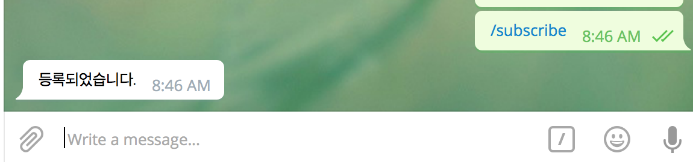

DynamoDB에도 잘 들어간걸 볼 수 있습니다.

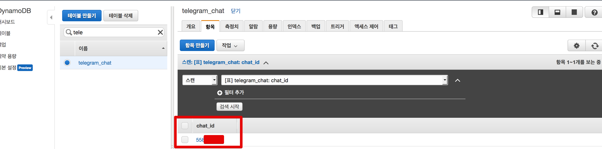

등록/등록 취소가 완료되었으니 전체 공지를 진행해보겠습니다!

## 2. 공지 람다 추가

공지는 새로운 Lambda를 생성하겠습니다.  

> 기존에 생성했던 Bot Lambda에서 쓰기엔 노출 위험이 크기 때문입니다.  

기존 Lambda와 같은 값으로 설정해서 생성합니다.

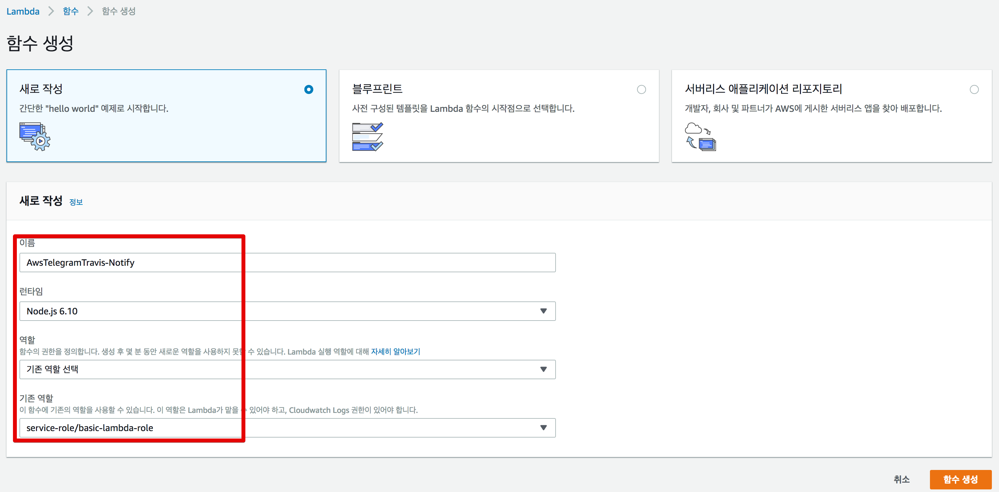

> 서비스 역할은 기존 Lambda에서 쓰던 Role 그대로 선택합니다.

그럼 아래처럼 DynamoDB 에 접근할 수 있는 Lambda 함수가 생성됩니다.

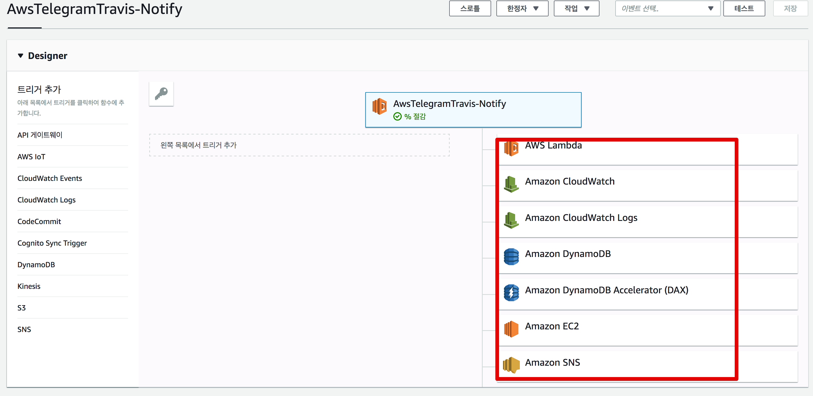

그럼 아래로 내려가 함수에 코드를 등록합니다.

```js
const TOKEN = process.env.TOKEN;
const TABLE_NAME = process.env.TABLE_NAME;

const https = require('https');
const util = require('util');
const AWS = require('aws-sdk'),
    docClient = new AWS.DynamoDB.DocumentClient();

exports.handler = (event, context) => {
    console.log(JSON.stringify(event));
    const requestText = event.message.text;
    const payload = {
        TableName: TABLE_NAME,
    };

    docClient.scan(payload, (err, data)=> {
        if(err){
            throw err;
        }
        console.log("총 발송인원: "+data.Items.length);
        console.log(JSON.stringify(data.Items));

        data.Items.forEach(subscriber => {
            const postData = {
                "chat_id": subscriber['chat_id'],
                "text": requestText
            };
            sendMessage(context, postData);
        });
    });
};

function sendMessage(context, postData) {
    const options = {
        method: 'POST',
        hostname: 'api.telegram.org',
        port: 443,
        headers: {"Content-Type": "application/json"},
        path: "/bot" + TOKEN + "/sendMessage"
    };

    const req = https.request(options, (res) => {
        res.setEncoding('utf8');
        res.on('data', (chunk) => {
            context.done(null);
        });
    });

    req.on('error', function (e) {
        console.log('problem with request: ' + e.message);
    });

    req.write(util.format("%j", postData));
    req.end();
}

```

코드는 앞에서 진행했던 코드와 크게 차이나지 않습니다.  

* ```docClient.scan```
    * DynamoDB를 풀스캔 (전체 조회) 합니다.


전체 조회한 결과를 하나씩 ```for```를 통해 메세지를 전송합니다.  
코드가 다 등록되셨다면 아래의 환경 변수값을 등록합니다.  
TOKEN은 Telegram Token을 쓰시면 됩니다.


환경 변수 아래에는 기본 설정이 있습니다.  
여기서 **제한 시간은 5분**을 지정합니다.

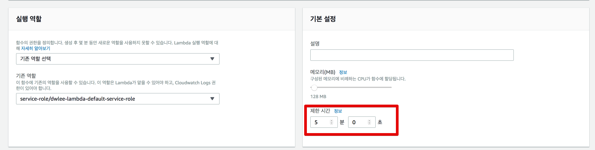

기본값은 3초이지만, 저장된 전체 chat_id를 조회해서 발송하다보면 제한 시간을 초과할때가 있습니다.  
초과하게 되면 발송 도중에 Lambda가 종료되기 때문에 넉넉하게 잡겠습니다.  

> 5분이 최대값입니다.

여기까지 되셨으면 한번 테스트를 해보겠습니다.

### 테스트

Lambda 상단 우측의 **테스트 이벤트 구성**을 클릭합니다.

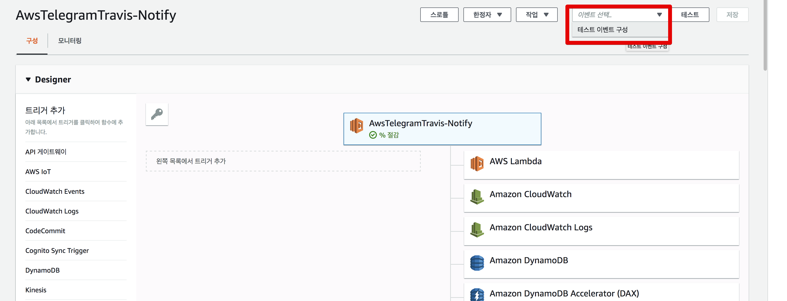

그리고 아래와 같이 테스트 코드를 생성합니다.

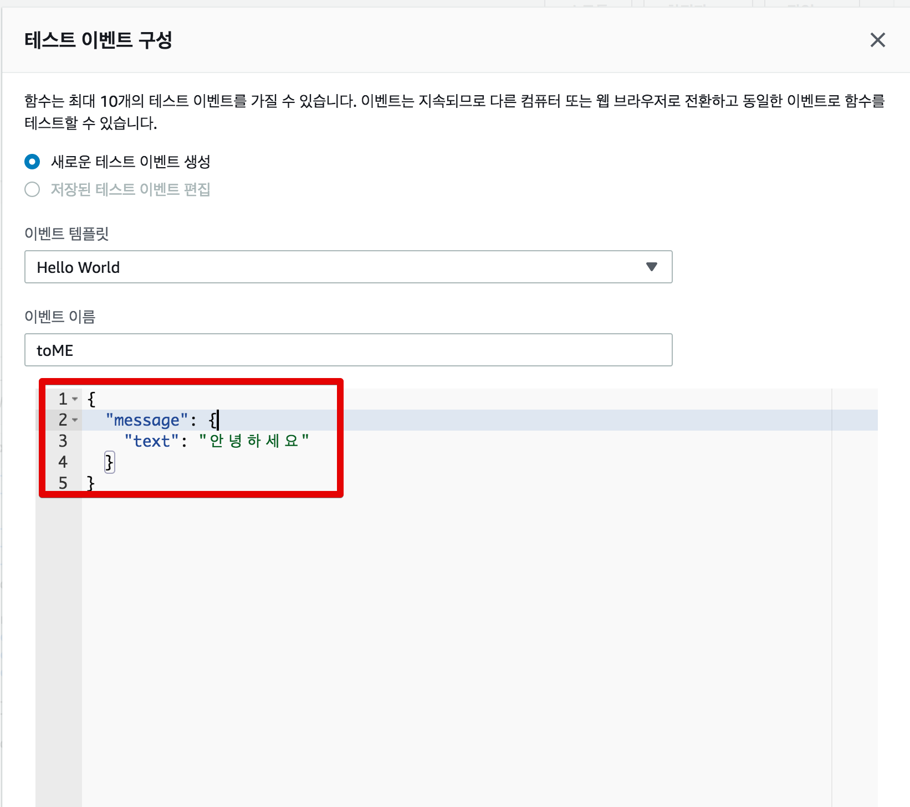

테스트 코드가 완성이 되셨으면 한번 테스트를 실행해봅니다.  
테스트가 실행되시면!

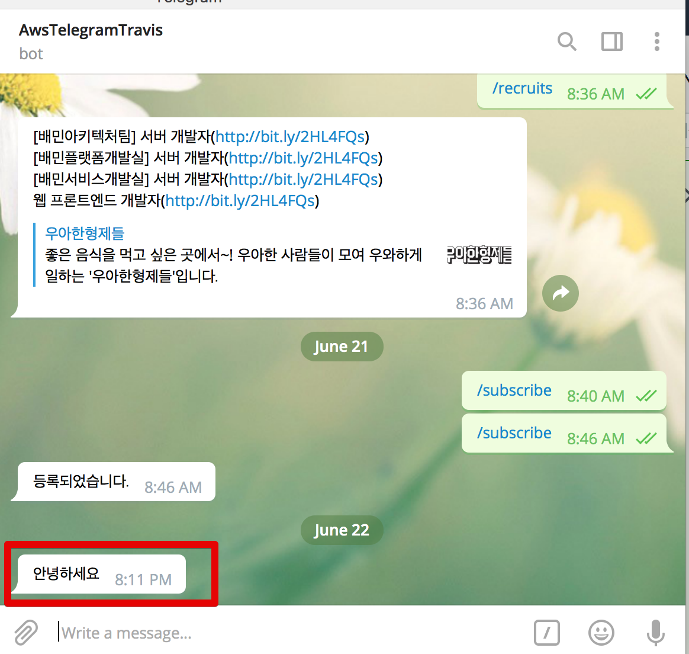

이렇게 Telegram에 바로 테스트 메세지가 전달 됩니다.  
Lambda 메인을 보시면 로그도 아주 이쁘게 찍혀있는것을 볼 수 있습니다.

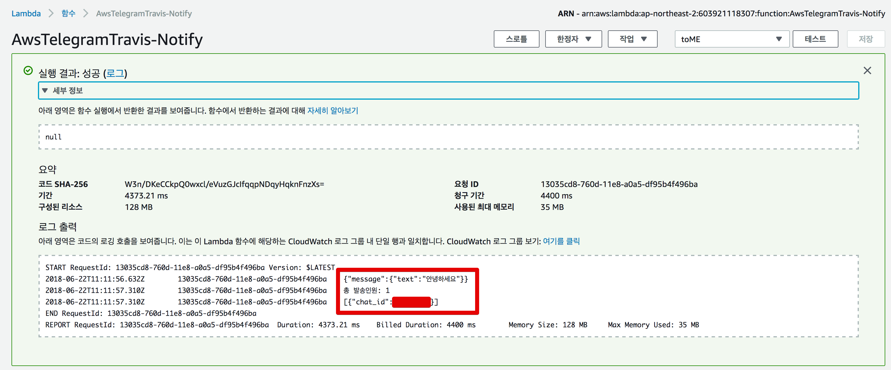

자 이제 공지 Lambda까지 완성되었습니다!  
대망의 마지막 API를 진행하겠습니다!

## 3. 전체 공지 API 추가

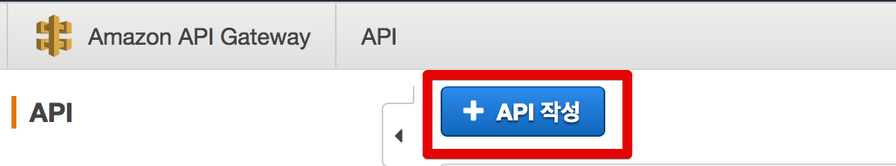

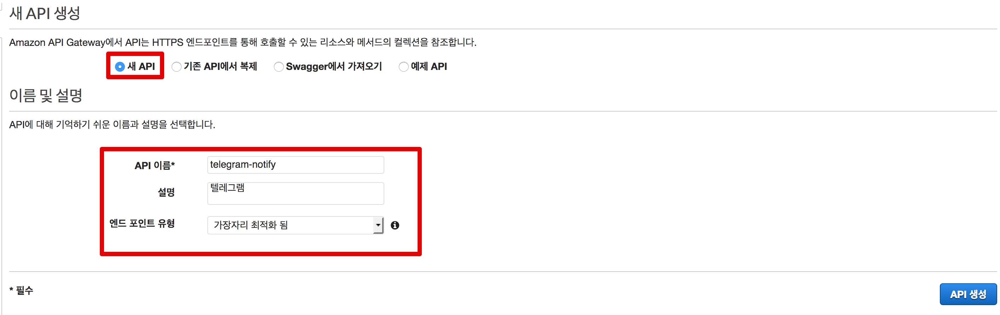

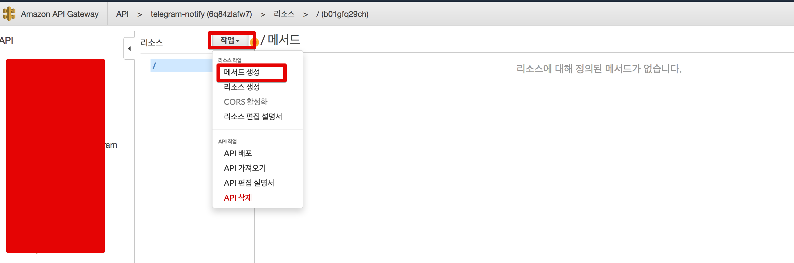

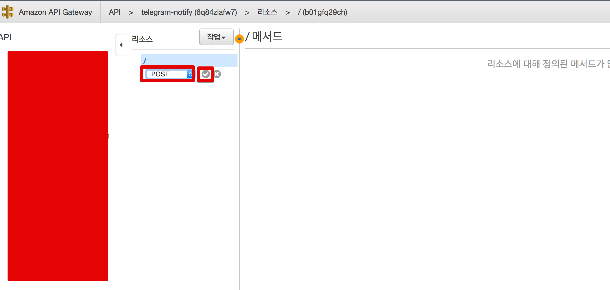

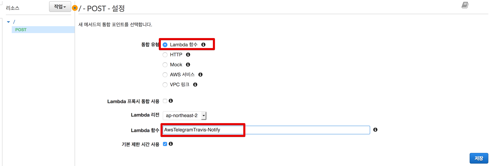

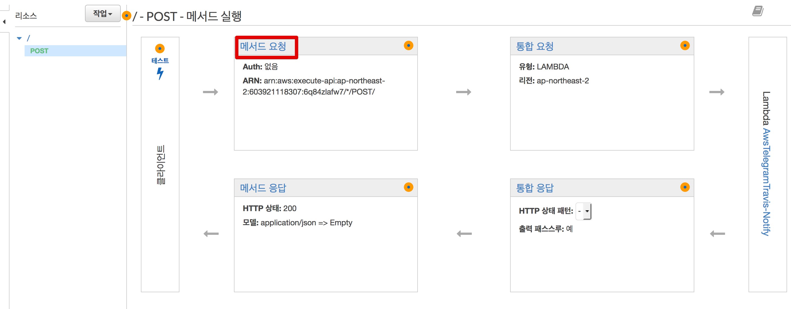

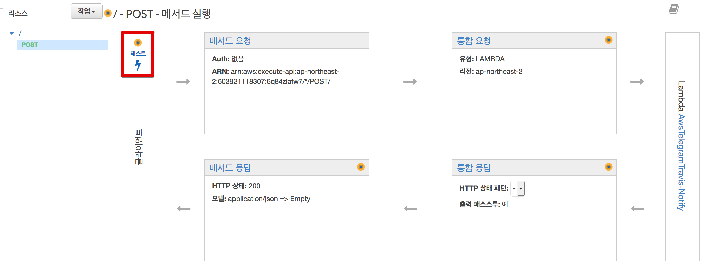

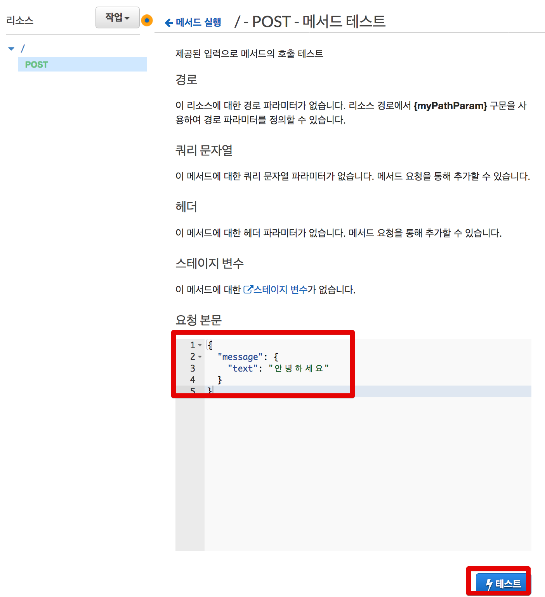

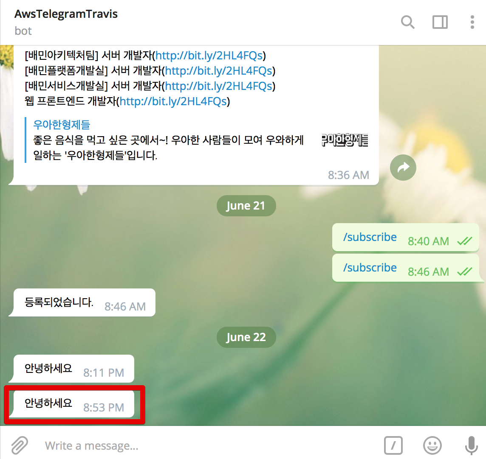

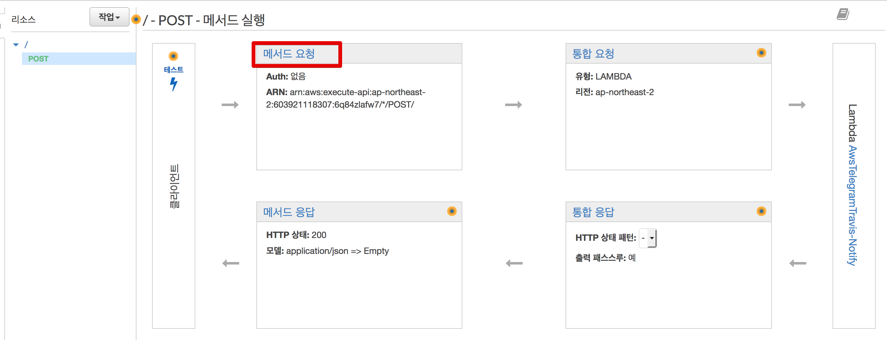

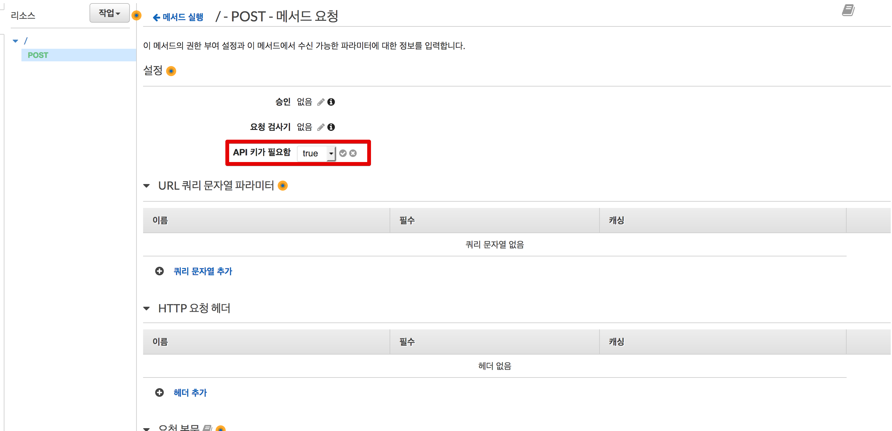

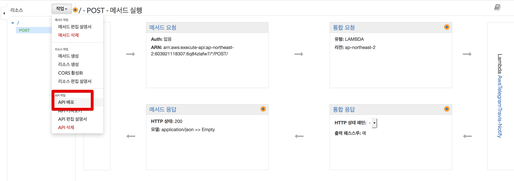
